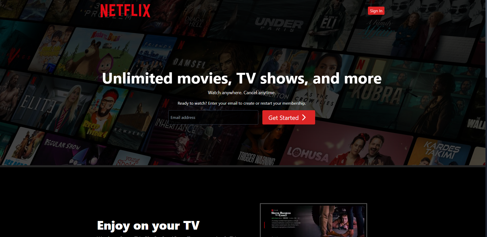

# 🎬 Netflix Clone - Modern Streaming Platform

 <!-- Add your screenshot path -->

A feature-rich Netflix clone built with modern web technologies, featuring real movie data from TMDB API, user authentication, and personalized recommendations.

## 🚀 Live Demo

<!-- Replace with your actual demo link -->

## ✨ Features

-   **TMDB Integration** - Real movie/TV show data
-   **User Authentication** - JWT secure login/signup
-   **Personalized Profiles** - Favorite movies list
-   **Responsive Design** - Mobile, tablet & desktop ready
-   **Modern UI** - Netflix-inspired interface
-   **State Management** - Powered by Zustand
-   **Fast Performance** - Vite optimized builds

## 🛠 Tech Stack

**Frontend:**

-   ⚡ [Vite](https://vitejs.dev/) - Next-gen frontend tooling
-   🖼 [React](https://reactjs.org/) - JavaScript library
-   🐻 [Zustand](https://zustand-demo.pmnd.rs/) - State management
-   🎨 [Tailwind CSS](https://tailwindcss.com/) - Utility-first CSS
-   🔄 [Axios](https://axios-http.com/) - HTTP requests

**Backend:**

-   🟢 [Node.js](https://nodejs.org/) - JavaScript runtime
-   🚂 [Express](https://expressjs.com/) - Web framework
-   🍃 [MongoDB](https://www.mongodb.com/) - NoSQL database
-   🏗 [Mongoose](https://mongoosejs.com/) - MongoDB modeling
-   🔑 [JWT](https://jwt.io/) - Authentication
-   🎥 [TMDB API](https://www.themoviedb.org/) - Movie data

## 📦 Installation

### Prerequisites

-   Node.js v16+
-   MongoDB Atlas account or local MongoDB
-   TMDB API key ([Get one here](https://www.themoviedb.org/settings/api))
